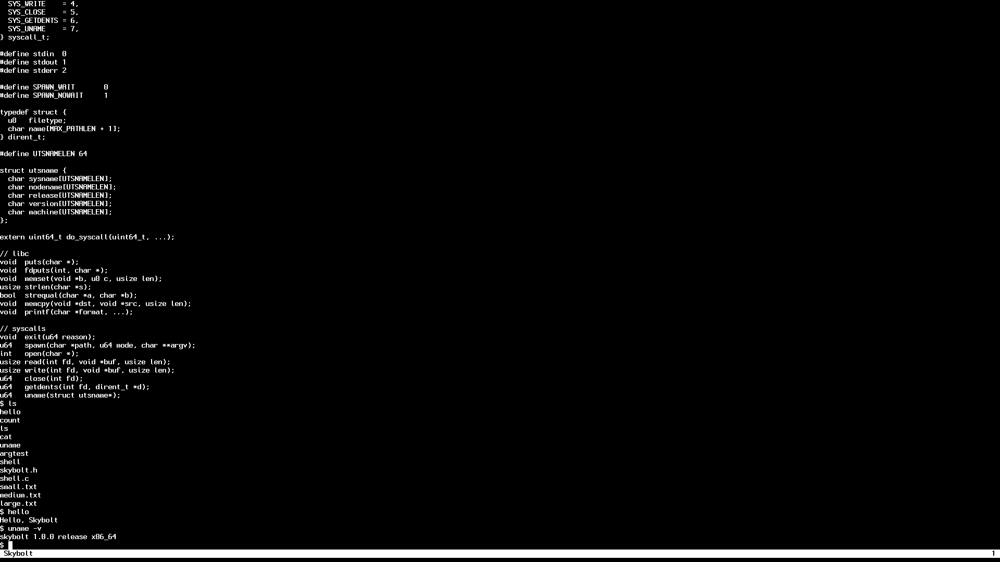

Skybolt is a cross-platform, preemptive, multitasking, monolithic, UNIX-like
operating system designed to be easy to understand and hack on. It runs on 3
different ISAs and is tested on real hardware.



Skybolt running at 1920x1080 on `x86_64`.

## Features

⚡️ `x86_64`, `aarch64`, and `riscv64` support.

⚡️ Tested on real X86 PCs (variety of PC laptops and desktops), Raspberry Pi 4B, and Qemu.

⚡️ Higher half 64 bit design.

⚡️ Preemptive multitasking.

⚡️ Userspace tasks.

⚡️ Kernel tasks (for idling, asynchronously repainting the screen, and managing terminals).

⚡️ TAR ramdisk.

⚡️ ELF loader.

⚡️ UART drivers: 16550, PL011.

⚡️ Interrupt controllers: APIC (IOAPIC + LAPIC), ARM GIC, PLIC.

⚡️ Timer drivers: LAPIC timer, ARM generic timer, RISCV s-mode timer.

⚡️ Keyboard driver: PS/2 (PC only).

⚡️ 1920 by 1080 HD graphics (PC only, when booted with GRUB).

⚡️ Contains 100% pure human written code- just the way mom used to make it.

# Quickstart

How to build and run the `x86_64` release version of Skybolt in Qemu:

1. Open dev container: `./dev.sh` (or `.\windev.bat` if on Windows)
2. In container, `make -j PLATFORM=PC CONFIG=RELEASE`
3. On host OS: `./run.sh pc` (or `.\winrun.bat pc` if on Windows)

Skybolt should boot up in a new window!

## Quitting Qemu

Quit Qemu with `Ctrl+A` followed by `X` in the terminal you ran `run.sh` / `winrun.bat` in.

# General Compilation Flow

Building Skybolt always takes the following steps:

1. Launch the development container (`dev.sh` on Linux/ macOS, `windev.bat` on Windows)
2. Build the kernel in the container with `make -j PLATFORM=$(PLATFORM) CONFIG=$(CONFIG)`
3. To emulate in Qemu, use `run.sh` on Linux/ macOS, `winrun.bat` on Windows
4. (Optional) Run in debug mode by adding `debug` to the end of your `run.sh`
   command, then attach a debugger with `gdb.sh` from the container

The `make` step always produces at least two artifacts:
1. The kernel ELF, located at `bin/skybolt.$(ARCH).$(CONFIG).$(PLATFORM)`
1. The ramdisk image, located at `user/bin/$(ARCH)/fs.tar`

Some platforms produce more files than those two; see "Kernel Binaries" below for more.

The development container is available on Docker Hub and GitHub as
[`jprx/osdev-tools`](https://github.com/jprx/osdev-tools). It will be
automatically installed when you run `dev.sh` / `windev.bat`.

# Building from Source

Run `dev.sh` (`windev.bat` on Windows) to launch the dev container. The
`jprx/osdev-tools` Docker image has all the tools and debuggers you'll need to
build and debug Skybolt. (If you don't have [Docker](https://www.docker.com),
install it first).

Skybolt is always built with the following `make` invocation:

`make -j PLATFORM=$(PLATFORM) CONFIG=$(CONFIG)`

Where `$(PLATFORM)` is one of:
- `X86_64`  (or equivalently, `PC`)
- `AARCH64` (or equivalently, `RASPI`)
- `RISCV64` (or equivalently, `VIRT_RISCV`)

And `$(CONFIG)` is one of:
- `RELEASE` (runs fast, but hard to debug with GDB)
- `DEBUG` (runs slow, but easier to debug with GDB)

### Example Build Commands

Build for running:

| Target          | Build Command                          |
|-----------------|----------------------------------------|
| X86 PC          | `make PLATFORM=X86_64  CONFIG=RELEASE` |
| Raspberry Pi 4B | `make PLATFORM=AARCH64 CONFIG=RELEASE` |
| Qemu virt RISCV | `make PLATFORM=RISCV64 CONFIG=RELEASE` |

Build for debugging:

| Target          | Build Command                        |
|-----------------|--------------------------------------|
| X86 PC          | `make PLATFORM=X86_64  CONFIG=DEBUG` |
| Raspberry Pi 4B | `make PLATFORM=AARCH64 CONFIG=DEBUG` |
| Qemu virt RISCV | `make PLATFORM=RISCV64 CONFIG=DEBUG` |

If `CONFIG` is omitted from the `make` invocation, the `RELEASE` variant is built by default.

# Running in Qemu

Ensure [`qemu`](https://www.qemu.org) is installed on your OS. (Windows users: make sure Qemu is added to your path).

Skybolt is launched with `run.sh` (`winrun.bat` on Windows) as follows:

`run.sh $(PLATFORM) $(DEBUG_MODE)`

Where `$(DEBUG_MODE)` is one of:
- `debug` if you want Qemu to wait for a debugger.
- Empty if you don't.

By default, `run.sh` (and `winrun.bat`) will try to use the `RELEASE` version
of the kernel (compiled with `CONFIG=RELEASE`). However, when running in debug
mode, the scripts will try to launch the `DEBUG` version of the kernel instead
(compiled with `CONFIG=DEBUG`).

Setting `$(PLATFORM)` to one of the following boots Skybolt without graphics (serial output only) using
Qemu's `-kernel` flag:
- `x86`
- `arm`
- `riscv`

Setting `$(PLATFORM)` to the following will boot a full PC system emulator,
booting from the Skybolt ISO, using GRUB as the bootloader, and booting with an
emulated display (in a new window) and keyboard:
- `pc`

The full system (keyboard, display, etc.) is only supported on the X86 PC
platform. ARM and RISCV systems are stuck with just using a serial port for
now.

### Example Run Commands

Run the `RELEASE` kernel headlessly, just using the serial port:

| Command          | What it gives you                    |
|------------------|--------------------------------------|
| `run.sh x86`     | Headless X86_64 PC (serial only)     |
| `run.sh arm`     | Headless AARCH64 Raspi (serial only) |
| `run.sh riscv`   | Headless virt riscv (serial only)    |

Run `skybolt.iso` with full display, keyboard, and GRUB bootloader (opens a GUI window):

| Command          | What it gives you                     |
|------------------|---------------------------------------|
| `run.sh pc`      | Full PC Emulation (keyboard, display) |

## Running with a Debugger

If you want to debug the kernel, add `debug` to the end of the `run.sh` (or
`winrun.bat`) invocation. By default, the `DEBUG` variant of the kernel will be
used when running in `debug` mode, so you'll need to make sure you compiled the
kernel with `CONFIG=DEBUG`.

Instead of starting the system right away, Qemu will wait for you to attach a
debugger. In one window, use `run` or `winrun` to start the system, then use
`gdb.sh` from another terminal inside the dev tools container to attach to
Qemu. From there, you can set breakpoints, use `c` to start the kernel, or step
through the system using `si`.

| Command              | What it gives you                               |
|----------------------|-------------------------------------------------|
| `run.sh x86 debug`   | Headless X86_64 PC (serial only + debugger)     |
| `run.sh arm debug`   | Headless AARCH64 Raspi (serial only + debugger) |
| `run.sh riscv debug` | Headless virt riscv (serial only + debugger)    |

Qemu will wait for a debugger to be attached. In another terminal inside the dev tools container, use `gdb.sh` to attach
to Qemu on the default port (1234):

| GDB Command    | Meaning                               |
|----------------|---------------------------------------|
| `gdb.sh x86`   | Debug the PC / `x86` target           |
| `gdb.sh arm`   | Debug the Raspberry Pi / `arm` target |
| `gdb.sh riscv` | Debug the virt RISCV / `riscv` target |

`gdb.sh` **must** be run from within the dev tools container. Additionally, if
you cloned Skybolt on Windows, make sure you cloned using UNIX line endings,
otherwise `gdb.sh` won't work in the dev container.

# Kernel Binaries

The `bin/` directory holds intermediate object files as well as the final kernel image. Kernel ELFs are of the form
`skybolt.$(ARCH).$(CONFIG).$(PLATFORM)` and are located directly in the `bin` dir.

Some platforms have further requirements beyond being a 64 bit statically linked ELF file, so more build objects can be
produced. These will be described below.

### `PC (X86_64)` Extra Steps

After linking the final kernel at `skybolt.x86_64.$(CONFIG).pc`, two more files are produced:
- `skybolt.x86_64.$(CONFIG).pc.qemu` is a 32-bit ELF that can be loaded with Qemu's `-kernel` flag. Qemu's `-kernel`
flag requires 32 bit images, not 64 bit ones- the image contents are identical, just the file type is changed. This
kernel is used when running the kernel the "normal" way with `run.sh x86_64`.
- `skybolt.iso` is a full GRUB image. When `run.sh pc` is called, we use the full ISO instead of just the ELF, so that
GRUB is our bootloader instead of Qemu. This ISO image can be used to boot Skybolt on real hardware too.

### `RASPI (AARCH64)` Extra Steps

Raspberry Pi's bootloader needs a flat image, not an ELF. We create it with `objcopy`:
- `skybolt.aarch64.$(CONFIG).raspi.img` is the final image file that should be used for booting, both on real hardware
and with Qemu's `-kernel` flag. The ELF image is useful only for debugging.

# Writing new User Programs

`user/` contains all the user programs that end up on-disk inside of Skybolt.
You can make a new program by starting a new C file in `user` and adding your
program to `user/Makefile`'s list of programs to build. The only header you
should include is `skybolt.h` which has everything in our "C library" and
definitions for all syscalls. Your program will automatically be built for the
correct architecture and statically linked with the C library.

You can also add whatever files you want to the ramdisk, just toss them in
`user/files` and add them to the list of files in `user/Makefile`.

`user/libc` contains the "C library" used by Skybolt user progrms (currently
just one file). If you add a new syscall, make sure to update `skybolt.h` and
our libc at `user/libc/libc.c`.

Ramdisks are built for each ISA in the `user/` folder. They can be found at
`user/bin/$(ARCH)/fs.tar` along with all the files contained in the ramdisk for
that architecture.

# Booting on Real Hardware

**WARNING**: You should never run untrusted operating systems on hardware you care about. Data loss, permanent system
damage, or any other unexpected behavior is highly unlikely, but technically possible.

Skybolt is released under the MIT license:

```
THE SOFTWARE IS PROVIDED “AS IS”, WITHOUT WARRANTY OF ANY KIND, EXPRESS OR
IMPLIED, INCLUDING BUT NOT LIMITED TO THE WARRANTIES OF MERCHANTABILITY,
FITNESS FOR A PARTICULAR PURPOSE AND NONINFRINGEMENT. IN NO EVENT SHALL THE
AUTHORS OR COPYRIGHT HOLDERS BE LIABLE FOR ANY CLAIM, DAMAGES OR OTHER
LIABILITY, WHETHER IN AN ACTION OF CONTRACT, TORT OR OTHERWISE, ARISING FROM,
OUT OF OR IN CONNECTION WITH THE SOFTWARE OR THE USE OR OTHER DEALINGS IN THE
SOFTWARE.
```

If you want to run Skybolt on real hardware (PC or Raspberry Pi), I suggest you do the following:
- Make sure the hardware you're running on is junk and you don't care if it breaks.
- Remove any hard drives with important information from the system.
- Assume things will go wrong!

## Running on Real PC Hardware

Required hardware
1. A PC to run the OS on
2. A flash drive to install Skybolt to
3. A monitor (VGA, HDMI, anything- they should all work)
4. A keyboard (PS/2 is the best if your motherboard supports it; USB might work
   otherwise with legacy USB support). If using a laptop, the builtin keyboard
   should probably work.
6. (Optionally), an RS232 serial cable if you want to use the serial port as well.

Steps:
1. In a dev container (`dev.sh` or `windev.bat`), build Skybolt with `make -j PLATFORM=PC CONFIG=RELEASE`.
2. Your Skybolt ISO is at `bin/skybolt.iso`.
3. Use `run.sh pc` (`winrun.bat pc` on Windows) to confirm the system boots up from the ISO in an emulator as you'd
   expect.
4. Flash `bin/skybolt.iso` to a flash drive using your favorite method. (I use `dd`; Ventoy is another good choice).
5. Configure your target PC to use legacy boot mode in your BIOS. If an option
   exists for legacy PS/2 emulation of USB peripherals, enable it. You want
   pretty much every "legacy" option enabled. You also likely want secure boot
   disabled. Expect to tinker with BIOS settings.
6. Plug the flash drive into your PC and boot from it.
7. You should see Skybolt on the screen!
8. If PS/2 emulation is working (or you're using a real PS/2 keyboard) you should be able to type!
9. If your computer has an RS232 port, you should be able to hook up a serial cable and attach another computer to it
   and use Skybolt via serial as well.

## Running on Real Raspberry Pi Hardware

Required hardware
1. A Raspberry Pi 4B. If you want to use a different kind of Pi, you will.
   likely need to modify the device maps in `src/platform/raspi.c`.
2. A UART to USB adapter (eg. [an FTDI Adapter](https://www.microcenter.com/product/656323/inland-ftdi-adapter-usb-controller)).
3. An SD Card.

Steps:
1. Install 64 bit Linux on the SD card the normal Raspberry Pi way such that your SD card has a valid 64 bit Raspberry Pi filesystem.
2. Compile Skybolt with `make -j PLATFORM=RASPI CONFIG=RELEASE`
3. Copy `bin/skybolt.aarch64.release.raspi.img` (you want the one ending in `.img`) to your SD card as `skybolt.img`
4. Copy `user/bin/aarch64/fs.tar` to your SD card as `skybolt_disk.tar`
5. Edit `config.txt` on your SD card add the following to the bottom:

```
[all]
enable_uart=1
gpio=22-27=np
enable_jtag_gpio=1
kernel=skybolt.img
core_freq_min=500
dtoverlay=disable-bt
dtoverlay=uart1
initramfs skybolt_disk.tar 0x0000000008000000
```

6. Attach your UART adapter to the [UART0 pins](https://pinout.xyz/pinout/uart) (6- GND to GND, 8- TX to RX, 10- RX to
   TX)
7. On another device, if using Linux or macOS, open the serial port with the `screen` command. Eg. something like
   `screen /dev/tty.usbserial 115200`
8. If using Windows, use PuTTY
9. The BAUD rate is 115200.
10. Power up the Raspberry Pi, you should see a Skybolt shell appear after a few seconds
11. (Optional) if you have a JTAG adapter (eg. a J-link) you can attach it as
    well and use it to debug the Pi with `openocd`
